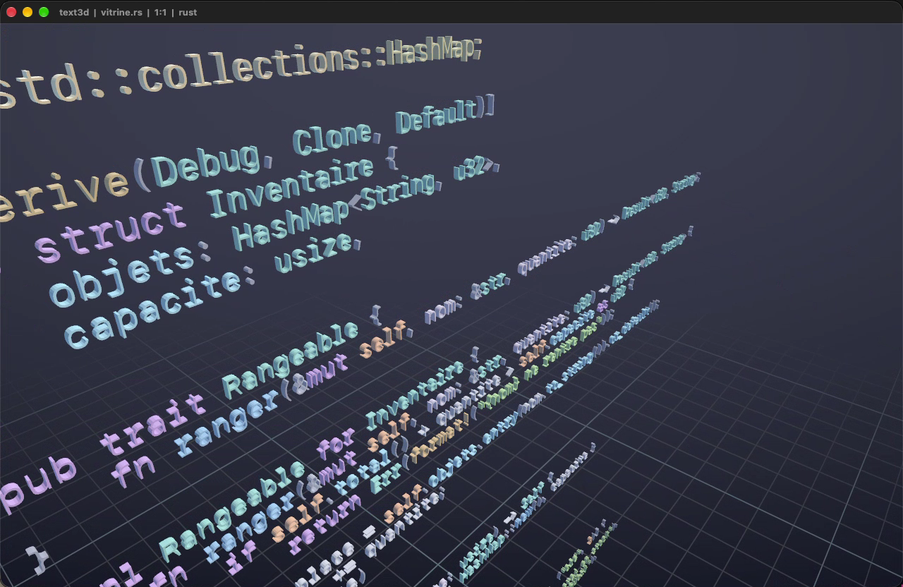
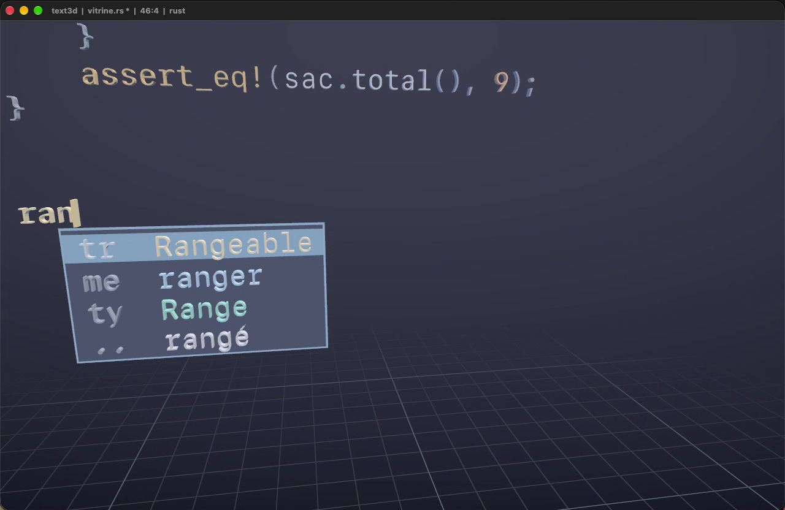

# text3d

## Commandes

| | |
|---|---|
| glisser gauche | tourner autour du texte |
| glisser droit | translater |
| molette | avancer / reculer |
| option + flèches | tourner au clavier |
| F1 / F2 / F3 | recadrer / ondulation / grille |
| tab, ctrl + espace | ouvrir la complétion |
| haut, bas, entrée, échap | parcourir, valider, fermer |
| cmd + S | enregistrer |
| cmd + C / X / V | copier, couper, coller la ligne |
| cmd + début / fin | haut ou bas du document |

## Aperçus

