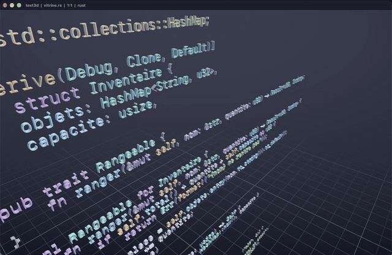

# text3d

Un bloc-notes où le texte est de la vraie géométrie 3D. Chaque glyphe est un maillage extrudé
depuis les contours de la fonte et rendu en instancié sur le GPU. On tourne autour, on zoome,
et on écrit dedans.



## Ce qu'il y a dedans

**Glyphes extrudés.** Les contours TrueType sont tessellés avec lyon, puis extrudés : capot avant,
capot arrière à winding inversé, un mur par arête avec sa normale orientée selon l'aire signée du
contour. Ombrage plat, arêtes nettes.

**Rendu instancié.** Un maillage par glyphe distinct, gardé en cache dans un atlas. Les instances
sont regroupées par tri comptage, donc un seul draw call par glyphe distinct quel que soit le
nombre de caractères à l'écran. Fenêtre glissante de 160 lignes autour du curseur, brouillard calé
sur cette limite pour que la coupe reste invisible.

**Coloration syntaxique Rust et C#.** tree-sitter avec les requêtes `highlights.scm` officielles.
À chaque frappe, un diff préfixe/suffixe donne un `InputEdit` minimal et seule la partie modifiée
est reparsée ; la requête ne tourne que sur la fenêtre visible.

**Complétion locale.** Trois sources fusionnées : les symboles définis dans le fichier (extraits
via `tags.scm`), les mots-clés et types du langage, les mots du tampon. Classement fuzzy avec
nucleo-matcher. Le popup est rendu en 3D dans la scène.

## Commandes

| | |
|---|---|
| glisser gauche | tourner autour du texte |
| glisser droit | translater |
| molette | avancer / reculer |
| option + flèches | tourner au clavier |
| F1 / F2 / F3 | recadrer / ondulation / grille |
| tab, ctrl + espace | ouvrir la complétion |
| haut, bas, entrée, échap | parcourir, valider, fermer |
| cmd + S | enregistrer |
| cmd + C / X / V | copier, couper, coller la ligne |
| cmd + début / fin | haut ou bas du document |

## Lancer

```
cargo run --release -- fichier.rs
```

Sans argument, un texte de démonstration s'affiche. La fonte est cherchée dans les polices
monospace du système.

## Aperçus


