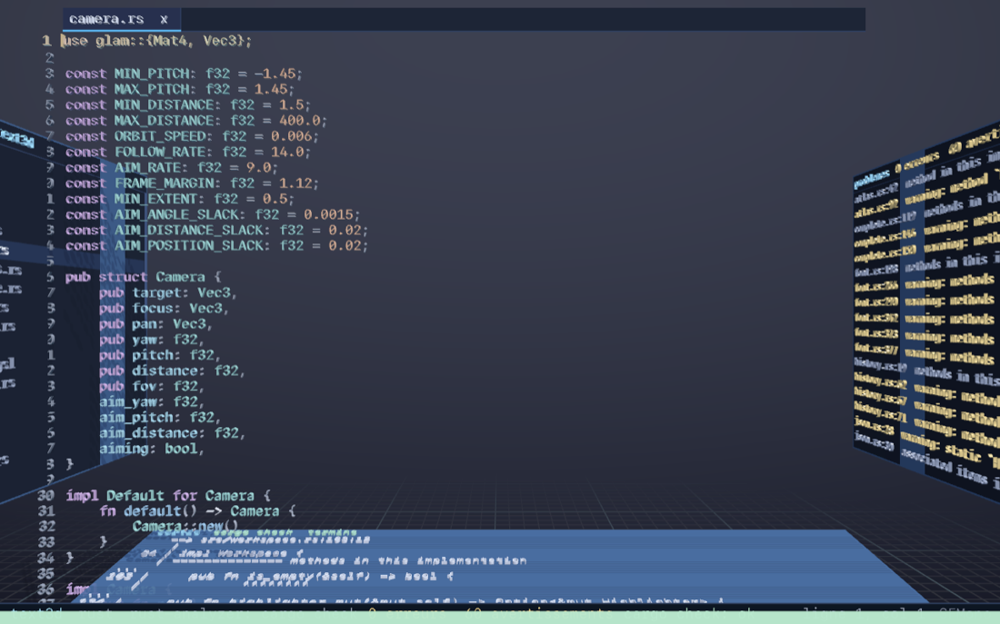
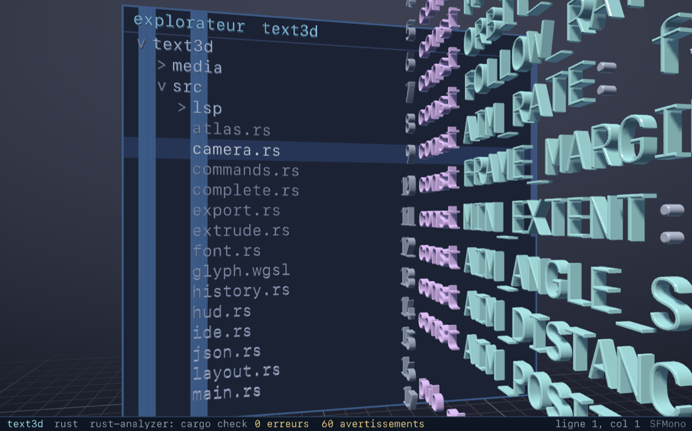

# text3d

Éditeur de texte en trois dimensions : chaque glyphe est un maillage extrudé et biseauté, et la
caméra orbite autour du document. Les panneaux persistants de l'IDE ne sont pas collés à l'écran :
ce sont des meubles posés dans une **pièce** construite autour du code, et on tourne la vue pour
les consulter.

| surface | position | contenu |
|---|---|---|
| code | plan central | le texte, les numéros de ligne, les diagnostics |
| onglets | dans le plan du code, au-dessus de la ligne 0 | les onglets ouverts |
| arbre de fichiers | mur gauche | l'arborescence du projet |
| problèmes | mur droit | les diagnostics du serveur de langage |
| terminal | sol | la sortie des tâches cargo / dotnet |
| résultats | plafond | la recherche projet et les références |

Restent face caméra : les palettes (ouverture rapide, symboles, commandes, renommage), la barre
d'état, la carte de survol, l'aide à la signature et le popup de complétion.

## Indice périphérique

Quand une surface hors champ a du nouveau, une bande fine s'allume pendant trois secondes sur le
bord d'écran correspondant — gauche pour l'arbre, droite pour les problèmes, haut pour les
résultats, bas pour le terminal :

| couleur | signification |
|---|---|
| verte | la tâche s'est terminée sans erreur, ou les erreurs ont disparu |
| rouge | la tâche a échoué, ou des erreurs sont apparues |
| bleue | information : tâche interrompue, avertissements, résultats de recherche arrivés |

## La pièce

| | |
|---|---|
| option + gauche | viser l'arbre de fichiers |
| option + droite | viser les problèmes |
| option + bas | viser le terminal |
| option + haut | viser les résultats |
| option + entrée | revenir au code |
| option + 1 | recadrer la vue |

Ouvrir un panneau vise sa surface, le fermer ramène au code. Ouvrir un fichier — depuis l'arbre,
une ligne de résultat, un problème, une ligne du terminal ou un aller à la définition — ramène
toujours la vue au code.

## Projet

| | |
|---|---|
| cmd + O | ouvrir un projet |
| cmd + P | ouverture rapide de fichier |
| cmd + shift + O | symboles du document |
| cmd + T | symboles du projet |
| cmd + shift + F | rechercher dans le projet (plafond) |
| cmd + shift + P | palette de commandes |
| cmd + shift + E | arbre de fichiers (mur gauche) |
| ctrl + ' | panneau de sortie (sol) |
| cmd + shift + M | problèmes (mur droit) |

## Langage

| | |
|---|---|
| F12, cmd + clic | aller à la définition |
| shift + F12 | références |
| F2 | renommer |
| shift + option + F | formater |

## Tâches

| | |
|---|---|
| cmd + B | vérifier (cargo check / dotnet build) |
| cmd + shift + B | compiler |
| cmd + R | lancer |
| cmd + shift + T | tester |
| cmd + shift + K | clippy |
| cmd + . | arrêter la tâche |

Une tâche lancée ne détourne pas la vue : elle remplit le sol, et le bord bas de l'écran s'allume
quand elle se termine.

## Onglets

| | |
|---|---|
| cmd + W | fermer l'onglet |
| ctrl + tab, ctrl + shift + tab | onglet suivant, précédent |
| cmd + 1 à cmd + 9 | aller à l'onglet n |
| ctrl + option + gauche / droite | retour, avant dans les sauts |

## Édition

| | |
|---|---|
| shift + flèches | étendre la sélection |
| cmd + option + flèches | se déplacer par mot |
| cmd + A | tout sélectionner |
| cmd + C / X / V | copier, couper, coller |
| cmd + Z, cmd + shift + Z | annuler, refaire |
| option + retour | effacer le mot à gauche |
| cmd + S, cmd + option + S | enregistrer, tout enregistrer |
| tab, ctrl + espace | ouvrir la complétion |
| cmd + gauche / droite | début ou fin de ligne |
| cmd + haut / bas | haut ou bas du document |
| cmd + Q | quitter |

## Recherche dans le fichier

| | |
|---|---|
| cmd + F | ouvrir la barre |
| entrée, shift + entrée | occurrence suivante, précédente |
| tab | champ de remplacement |
| cmd + entrée | tout remplacer |
| cmd + G | suivante sans la barre |
| échap | fermer |

## Vue

| | |
|---|---|
| option + 1 | recadrer |
| option + 2 | ondulation |
| option + 3 | grille |
| option + 4 | ombres portées |
| option + 5 | fonte suivante |
| option + 6 | biseau |
| option + 7 | relief par indentation |
| option + 8 | numéros de ligne |

## Souris

| | |
|---|---|
| clic gauche | poser le curseur |
| double clic, triple clic | sélectionner le mot, la ligne |
| shift + glisser | sélectionner à la souris |
| glisser gauche | tourner autour du texte |
| glisser droit | translater |
| clic sur un meuble non visé | viser cette surface ; le clic suivant agit dessus |
| molette | défiler la surface survolée, zoomer au-dessus du code |

## Export

| | |
|---|---|
| option + E | maillage obj |
| option + shift + E | maillage glb |
| option + P | capture png |

## Aperçus

La pièce vue depuis le code : l'arbre à gauche, les problèmes à droite, le terminal au sol, et la
bande verte au bord bas qui signale que la compilation vient de se terminer.

Le mur gauche visé par `option + gauche`, le code lu par la tranche à droite.

Le relief des glyphes et la complétion, inchangés.

